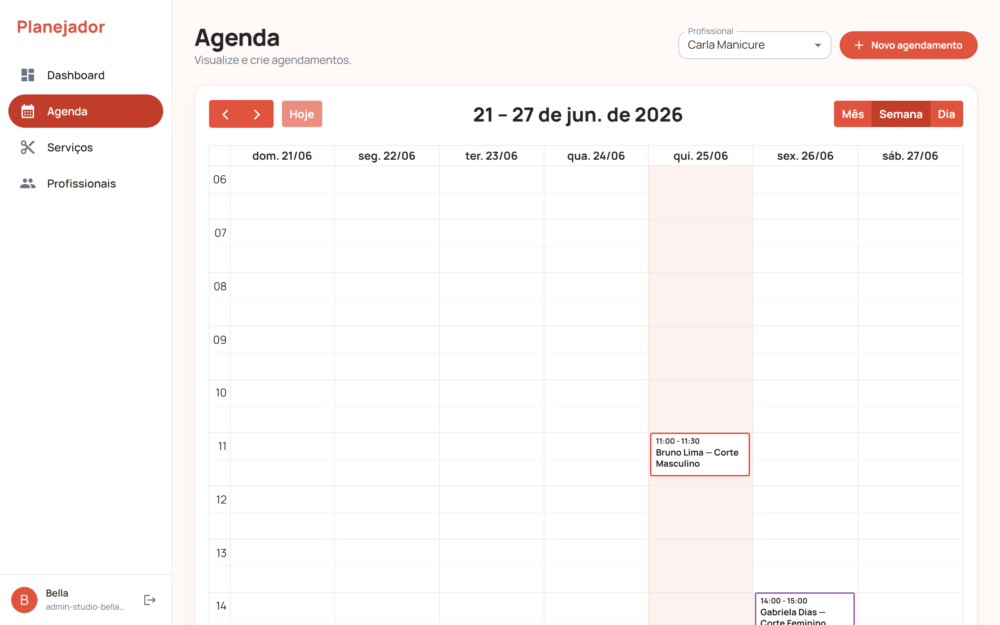
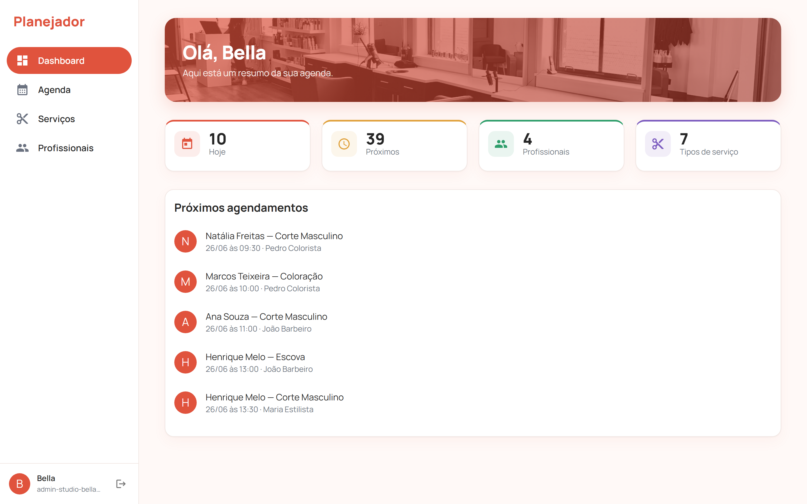
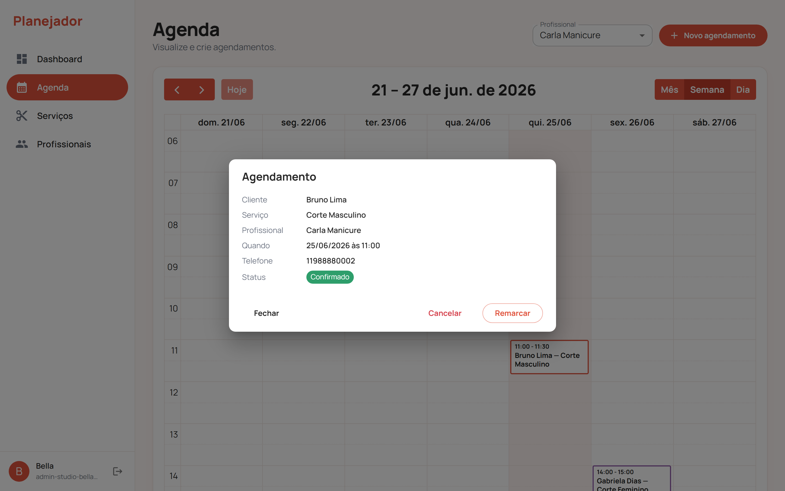
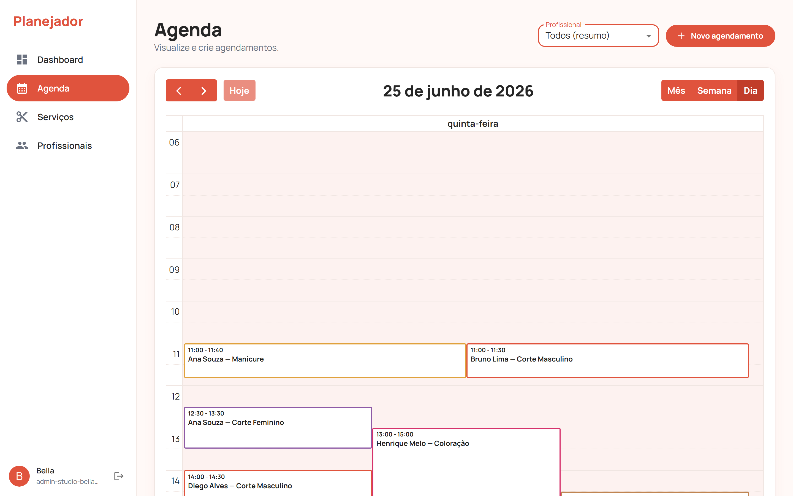
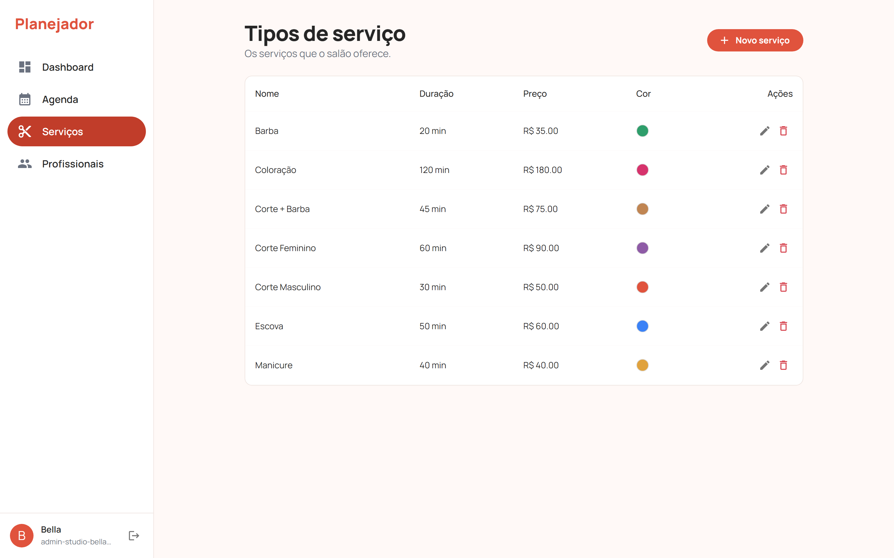
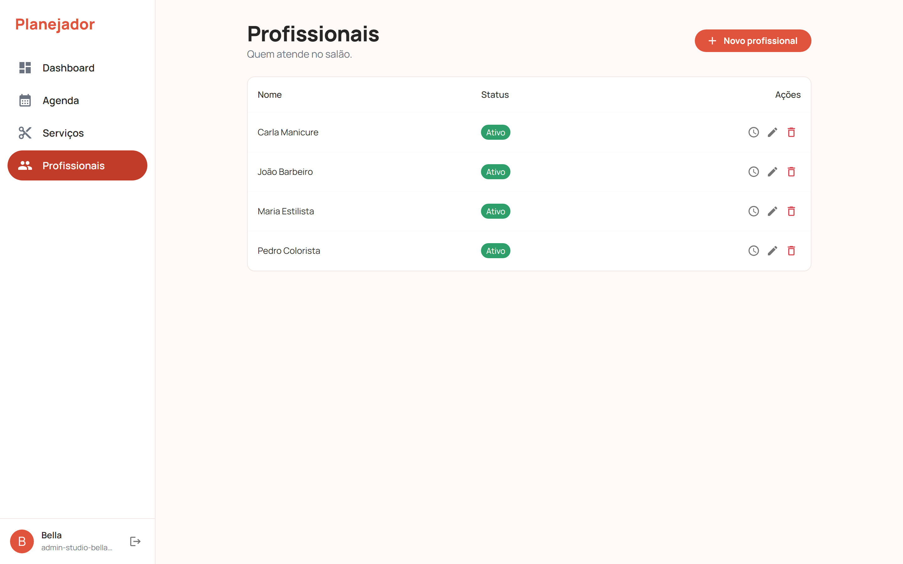
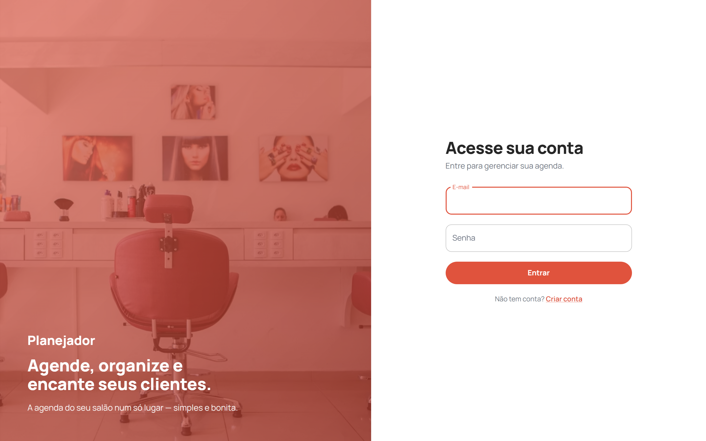

<h1 align="center">Planejador</h1>

<p align="center">
  <b>SaaS de agendamento multi-tenant para profissionais de beleza</b><br/>
  <i>Multi-tenant scheduling SaaS for beauty professionals — hair, barber & esthetics</i>
</p>

<p align="center">
  <a href="https://planejador-psi.vercel.app"><b>▶ Demo ao vivo · Live demo</b></a>
</p>

<p align="center">
  
  
  
  
  
  
  
</p>

---

## ✨ Visão geral

O **Planejador** é um sistema de agendamento onde **cada salão é um _tenant_ com dados
totalmente isolados** — equipe, serviços, profissionais e agenda próprios. Cabeleireiros,
barbeiros e esteticistas independentes gerenciam horários, **evitam conflitos de agenda**
e organizam seus clientes num painel simples e rápido.

*Each salon is a fully isolated tenant with its own team, services, professionals and
calendar — built to manage bookings and prevent scheduling conflicts.*

> 📌 Este é o **repositório-vitrine** do projeto. O código-fonte completo é **privado**
> (produto comercial). Aqui ficam a **demo ao vivo**, **capturas de tela**, a
> **arquitetura** e **trechos curados** do código.

---

## 🖥️ Telas · Screenshots

**Agenda — visão por profissional** (eventos coloridos por serviço, sem sobreposição)



<table>
  <tr>
    <td width="50%" valign="top"><b>Dashboard</b><br/></td>
    <td width="50%" valign="top"><b>Detalhe do agendamento</b><br/></td>
  </tr>
  <tr>
    <td valign="top"><b>Todos os profissionais (visão Dia)</b><br/></td>
    <td valign="top"><b>Serviços</b><br/></td>
  </tr>
  <tr>
    <td valign="top"><b>Profissionais</b><br/></td>
    <td valign="top"><b>Login</b><br/></td>
  </tr>
</table>

---

## 🧱 Stack

| Camada | Tecnologias |
|---|---|
| **Backend** | Python · Django · Django REST Framework · JWT (SimpleJWT) |
| **Frontend** | React · TypeScript · Vite · Material UI · React Query · Zustand · FullCalendar |
| **Banco** | PostgreSQL |
| **Qualidade** | 159 testes · 100% de cobertura · E2E (API + Playwright) |
| **Deploy** | Vercel (front) · Render (API) · Supabase (DB) |

---

## 🏛️ Arquitetura & destaques

- **Multi-tenancy** (_shared-schema_): coluna `tenant` em todas as tabelas + um
  `TenantFilterMixin` que **isola os dados de cada salão automaticamente**, sem repetir
  filtros em cada view.
- **Motor de disponibilidade**: calcula horários livres respeitando a **jornada de
  trabalho**, **exceções** (folgas e horários especiais) e os **agendamentos existentes**,
  com encaixe sequencial e descarte de horários no passado.
- **Padrão Selectors/Services**: regra de negócio separada das views → testável sem subir
  um request HTTP.
- **Autenticação JWT** com papéis (`SAAS_ADMIN` / `BUSINESS_ADMIN` / `OPERATOR`).
- **Datas em UTC** no banco; fuso do salão aplicado só na exibição.
- **159 testes, 100% de cobertura** no backend, mais E2E de API e de navegador (Playwright).

---

## 🔎 Trechos de código · Code highlights

> Amostras **curadas** (não-rodáveis) que mostram o estilo de código e as decisões de
> arquitetura. Arquivos completos em [`snippets/`](snippets/).

### 1. Isolamento multi-tenant — `TenantFilterMixin`

Toda ViewSet que herda este mixin passa a filtrar os dados pelo salão do usuário logado e
injeta o `tenant` ao criar registros. **Isolamento por construção** — um salão nunca
enxerga dados de outro.

```python
class TenantFilterMixin:
    """Garante isolamento por tenant em ViewSets/Generics."""

    def get_queryset(self):
        queryset = super().get_queryset()
        user = self.request.user
        if user.is_authenticated and getattr(user, 'tenant_id', None):
            return queryset.filter(tenant=user.tenant)
        return queryset.none()

    def perform_create(self, serializer):
        tenant = getattr(self.request.user, 'tenant', None)
        if tenant is None:
            raise PermissionDenied('Sua conta não está vinculada a um negócio. …')
        serializer.save(tenant=tenant)
```

### 2. Motor de disponibilidade — `get_available_slots`

Dado um profissional, uma data e um serviço, devolve os horários livres. Considera a
jornada, as exceções e os agendamentos já marcados, fazendo **encaixe sequencial**.

```python
def get_available_slots(professional, date, service_type):
    """Horários livres de um profissional numa data, para um serviço."""
    duration = timedelta(minutes=service_type.duration_minutes)
    now = timezone.now()

    # Agendamentos que ainda ocupam a agenda nesse dia, em UTC.
    day_start = datetime.combine(date, datetime.min.time(), tzinfo=BUSINESS_TZ)
    day_end = day_start + timedelta(days=1)
    busy = list(
        Appointment.objects.filter(
            professional=professional,
            status__in=Appointment.ACTIVE_STATUSES,
            start_datetime__lt=day_end,
            end_datetime__gt=day_start,
        ).values_list('start_datetime', 'end_datetime')
    )

    slots = []
    for start_time, end_time in _windows_for_date(professional, date):
        cursor = datetime.combine(date, start_time, tzinfo=BUSINESS_TZ)
        window_end = datetime.combine(date, end_time, tzinfo=BUSINESS_TZ)

        while cursor + duration <= window_end:
            slot_end = cursor + duration
            overlaps = any(b_start < slot_end and cursor < b_end for b_start, b_end in busy)
            if not overlaps and cursor >= now:
                slots.append(cursor)
                cursor = slot_end
            elif overlaps:
                # Pula até o fim do agendamento que conflita (encaixe sequencial).
                cursor = max(b_end for b_start, b_end in busy if b_start < slot_end and cursor < b_end)
            else:
                cursor = slot_end  # slot no passado

    return slots
```

### 3. Teste — sem duplo-agendamento

Numa janela de 3h com serviço de 60 min há **3 horários**; depois de marcar 09:00, aquele
horário **some** da disponibilidade — o sistema não permite duplo-agendamento.

```python
def test_slots_in_empty_day(self):
    response = self._get_availability()
    starts = [s['start'] for s in response.data]
    self.assertEqual(len(starts), 3)            # 09:00, 10:00, 11:00

def test_booked_slot_is_removed(self):
    Appointment.objects.create(
        tenant=self.tenant, professional=self.prof, service_type=self.service_type,
        client_name='Maria', start_datetime=_local(self.monday, 9),
    )
    response = self._get_availability()
    self.assertEqual(len(response.data), 2)      # sobram só 10:00 e 11:00
```

---

## 📫 Contato · Contact

- 💼 LinkedIn: [angelica-assini](https://www.linkedin.com/in/angelica-assini/)
- 📧 [assini-angelica@gmail.com](mailto:assini-angelica@gmail.com)
